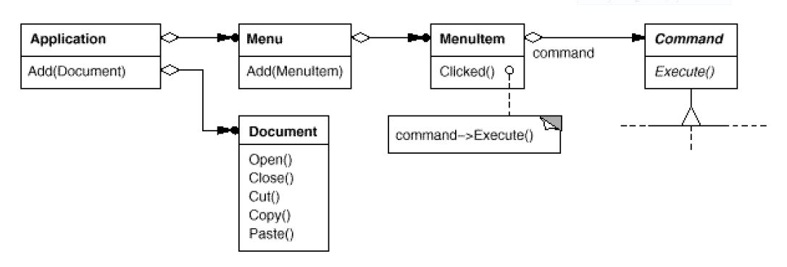
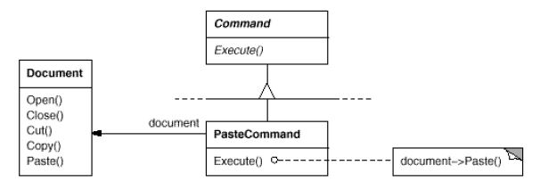
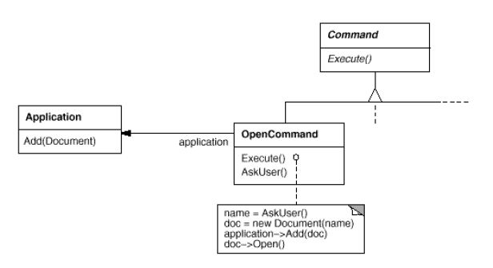
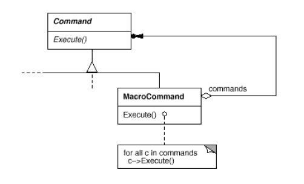
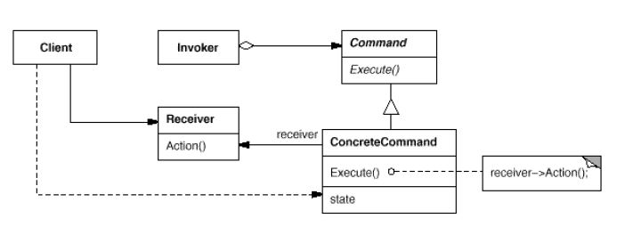
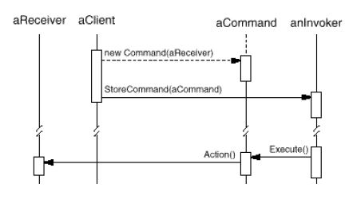
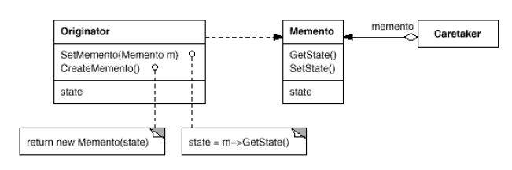
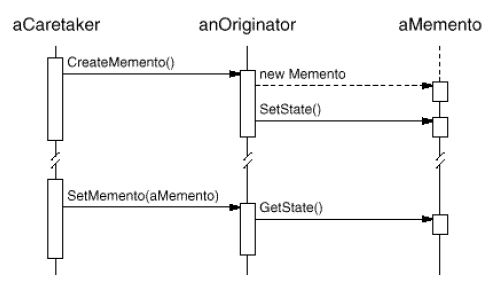

## Command... and conquer


***

## Intencja

*Encapsulate a request* as an *object*, thereby letting you parameterize clients with different requests, queue or log requests, and support undoable operations...

*Skojarzenia*: Dependency Inversion, słabe vs. silne powiązania, AOP (aspekty), zdarzenia

***

## Motywacja

It's necessary to issue requests to objects without knowing anything about the operation [...] or the receiver.

---

### Example: UI toolkit

User interface toolkits include objects like buttons and menus that carry out a request in response to user input. But the toolkit can't implement the request explicitly in the button or menu [...] have no way of knowing the receiver of the request or the operations that will carry it out.

---

### Let's see...



---

### Paste Command



Receiver: document->Paste()

---

### Open Command



Receiver: application->Add(doc)

---

### Macro Command

Sekwencje komend:



***

## Zastosowanie

- Commands are an object-oriented replacement for *callbacks*.
- When you want to: specify, queue, and execute requests at different times (asynchronicznie, zdalnie etc.)
- Support undo (Execute/Unexecute, store state needed to reverse)
- Logging (restore crashed system state from commands i.e. transactional journal)
- Structure a system around high-level operations built on primitives operations

***

## Structure



---

## Collaborations



***

## Konsekwencje

1. Command *decouples* the object that invokes the operation from the one that knows how to perform it.
2. Commands are *first-class objects*. They can be manipulated and extended like any other object (see: Decorator Pattern).
3. You can assemble commands into a *composite command* (see: Composite Pattern)

***

## Implementation / Considerations

1. How intelligent should a command be? Simple forwarding to receiver or full blown logic inside?
2. Supporting undo and redo i.e. storing history list of commands that have been executed
3. Using C++ templates (or C# generic) - if no need for undo or different arguments

***

DEMO

http://jsfiddle.net/5vt5uhfn/6/

***

## Memento


***

## Intencja

Without violating encapsulation, *capture and externalize* an object's *internal state* so that the object can be restored to this state later.

***

## Motywacja

Sometimes it's necessary to *record the internal state of an object*. This is required when implementing *checkpoints and undo mechanisms* [...] save state information somewhere [...] but objects normally *encapsulate their state*, making it inaccessible to other objects and impossible to save externally.

<!-- .element: class="fragment" -->
Panie Premierze, jak żyć?

***

## Kiedy stosować

- a snapshot of (some portion of) an object's state must be saved so that it can be restored to that state later, *and*
- a direct interface to obtaining the state would expose implementation details and break the object's encapsulation.

***

## Struktura




***

## Collaborations



***

## Konsekwencje

1. Preserving encapsulation boundaries (externalize state without revealing internals)
2. It simplifies Originator (no storage/history management)
3. Using mementos might be expensive (i.e. copying large amount of data)
4. Defining narrow and wide interfaces (difficult in some languages)
5. Hidden costs in caring for mementos (copying data, who deletes?)

***

## Implementation / Considerations

Language support (hiding memento internals) e.g. friend classes, generics, closures etc.

***

Przykład użycia (stan iteratora):

```cpp
template <class Item>
class Collection {
public:
    Collection();

    IterationState* CreateInitialState();
    void Next(IterationState*);
    bool IsDone(const IterationState*) const;
    Item CurrentItem(const IterationState*) const;
    IterationState* Copy(const IterationState*) const;

    void Append(const Item&);
    void Remove(const Item&);
// ...
};
```
- More than one state can work on the same collection
- It doesn't require breaking a collection's encapsulation to support iteration

***

DEMO

http://jsfiddle.net/5vt5uhfn/7/
